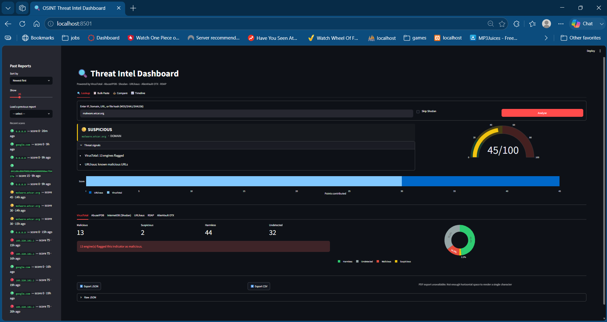
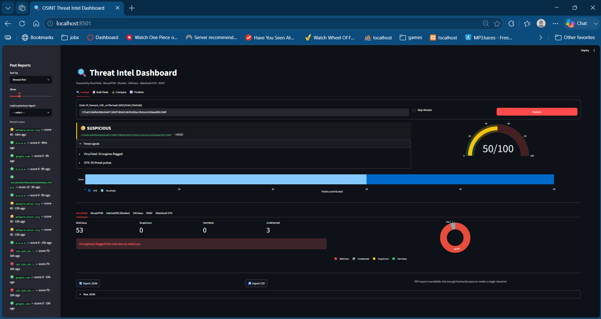
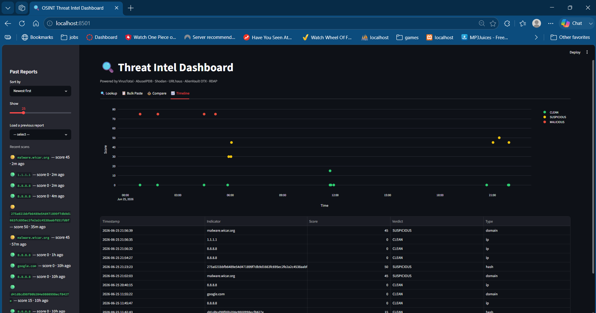
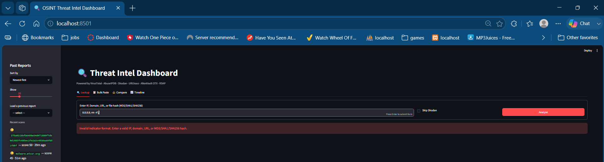

# OSINT Automation Tool

A threat intelligence aggregator — CLI and Streamlit dashboard — that investigates IPs, domains, URLs, and file hashes across six independent OSINT sources and produces a single weighted risk verdict. Built to automate the manual indicator-triage workflow common in SOC operations.

## What it does

Given an IP address, domain, URL, or file hash (MD5/SHA1/SHA256), the tool queries multiple threat intelligence sources concurrently and synthesizes the results into a single weighted verdict (CLEAN / SUSPICIOUS / MALICIOUS) with supporting reasons. All input is validated before use — malformed or unsafe indicators are rejected outright.

## Sources

| Source | Provides | Supports |
|--------|----------|----------|
| VirusTotal | Multi-engine reputation (90+ AV engines) | IP, domain, URL, hash |
| AbuseIPDB | IP abuse confidence score and report history | IP |
| Shodan InternetDB | Exposed ports, services, and known CVEs | IP |
| URLhaus (abuse.ch) | Known malware-distribution URLs / payload sightings | IP, domain, URL, hash |
| AlienVault OTX | Threat intelligence pulses and campaign tags | IP, domain, URL, hash |
| RDAP | Domain registration data and age | domain |

## Why multiple sources

Each source detects a different threat type. A Tor exit node, for example, shows clean on URLhaus (it hosts no malware) but flags 100% on AbuseIPDB (it's an attack source). Aggregating sources produces a complete risk picture that no single tool provides.

## Verdict scoring

Results are weighted by source reliability and combined into a 0–100 risk score:
- 0–20: CLEAN
- 21–50: SUSPICIOUS
- 51–100: MALICIOUS

## Project structure

```
osint.py              # thin CLI entrypoint (argparse, single/batch/file modes)
osint/
  config.py            # environment / API-key loading
  validation.py        # IOC validation & classification (IP/domain/URL/hash)
  throttle.py           # VirusTotal rate-limit throttling
  scoring.py            # weighted verdict calculation
  io_utils.py            # report persistence
  core.py                 # concurrent source fan-out (investigate())
  sources/                # one module per OSINT source
dashboard.py             # Streamlit dashboard (lookup, bulk, compare, timeline)
```

## Setup

```bash
git clone https://github.com/aakashsingh-sec/osint-automation-tool.git
cd osint-automation-tool
pip install -r requirements.txt
```

Copy `.env.example` to `.env` and add your API keys:

```bash
cp .env.example .env
```

## API keys required

Free-tier keys from: VirusTotal, AbuseIPDB, AlienVault OTX, URLhaus (auth.abuse.ch). Shodan InternetDB and RDAP require no key. Shodan and URLScan keys are optional.

## Usage (CLI)

```bash
python osint.py 8.8.8.8
python osint.py google.com
python osint.py https://example.com
python osint.py d41d8cd98f00b204e9800998ecf8427e   # MD5/SHA1/SHA256 hash

# Verbose / debug logging
python osint.py 8.8.8.8 --verbose
python osint.py 8.8.8.8 --debug
```

## File mode (batch)

```bash
python osint.py --file indicators.txt --workers 3
```

One indicator per line. Indicators are investigated concurrently (bounded by `--workers`); results are saved to a single combined JSON report.

## Dashboard

```bash
streamlit run dashboard.py
```

- **Lookup** — single-indicator analysis with a redesigned verdict card (score gauge, score-breakdown chart), per-source tabs, VirusTotal donut chart, AbuseIPDB country map, and JSON/CSV/PDF export
- **Bulk Paste** — paste multiple indicators (one per line) and run them all in one pass
- **Compare** — pick two past reports and view them side by side
- **Timeline** — score-over-time scatter plot across all saved reports
- Sidebar — sortable/filterable history with relative timestamps and colored verdict dots, plus a dark mode toggle
- Submissions are validated and throttled (2-second minimum between submits) to avoid hammering upstream APIs

## Screenshots

**Malicious verdict with threat breakdown**


**Hash lookup (MD5 / SHA1 / SHA256)**


**Timeline — score history across all saved reports**


**Input validation — malformed indicators are rejected**


## Gallery

| Screenshot | Description |
|---|---|
| [dashboard_homepage.png](screenshots/dashboard_homepage.png) | Landing page |
| [dashboard_mal_verdict.png](screenshots/dashboard_mal_verdict.png) | Malicious verdict with score breakdown |
| [dashboard_clean_verdict.png](screenshots/dashboard_clean_verdict.png) | Clean verdict |
| [dashboard_mal_hash_verdict.png](screenshots/dashboard_mal_hash_verdict.png) | Hash lookup result |
| [dashboard_invalid_input.png](screenshots/dashboard_invalid_input.png) | Input validation |
| [dashboard_rate_limit.png](screenshots/dashboard_rate_limit.png) | Rate-limit handling |
| [dashboard_bulk.png](screenshots/dashboard_bulk.png) | Bulk paste mode |
| [dashboard_compare.png](screenshots/dashboard_compare.png) | Side-by-side report comparison |
| [dashboard_timeline.png](screenshots/dashboard_timeline.png) | Score-over-time timeline |

## Tech stack

Python 3.11+, requests, rich, python-dotenv, OTXv2, streamlit, plotly, pandas, fpdf2

## Disclaimer

Built for defensive security research and SOC triage. Submitting indicators to public scanning services may alert threat actors that their infrastructure is under investigation.
